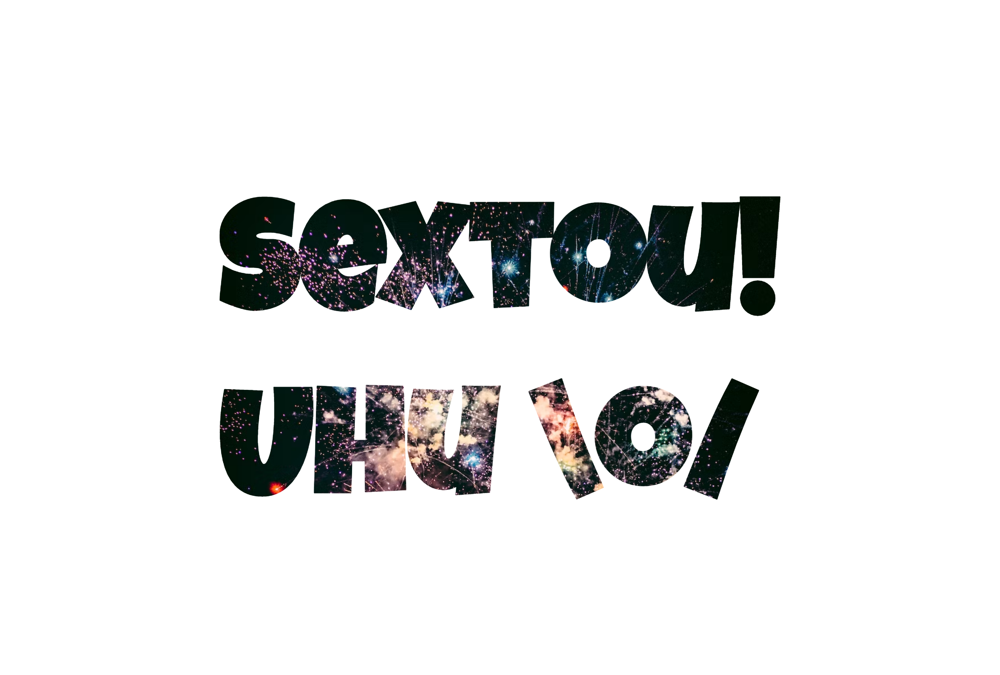

# Recorte de imagem com texto

Desenvolvido para aprendizado. Realizado efeito de imagem vazada com CSS. 15/10/22

[🔗 Clique aqui para acessar] (https://michel-maia.github.io/Recorte-de-imagem-com-texto/)

## 💻 Tecnologias

- HTML
- CSS

## Referência

- [Youtube] https://www.youtube.com/kepowob

- [mozilla] https://developer.mozilla.org/en-US/docs/Web/CSS/background-clip

img
-[unsplash] https://unsplash.com/
